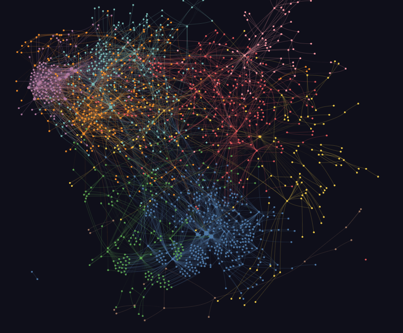
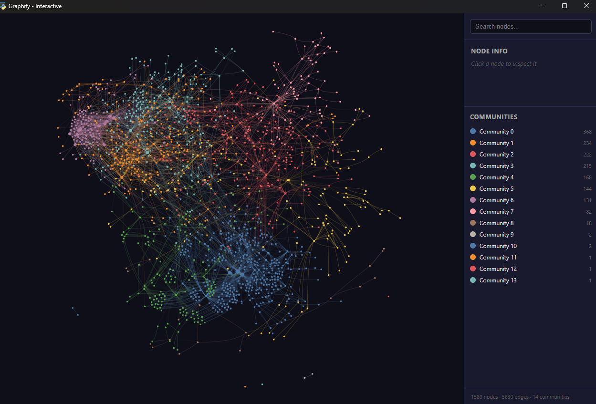

# Graphify Explorer

[](https://github.com/Stairwaytoknowledge/Graphify_Explorer_GUI_with_Chat/actions/workflows/ci.yml)

A desktop GUI on top of [graphify](https://github.com/safishamsi/graphify)
(by [Safi Shamsi](https://github.com/safishamsi),
[`graphifyy`](https://pypi.org/project/graphifyy/) on PyPI). Point it at a
local folder or a git URL and you get an interactive knowledge graph,
node-by-node details, and a chat tab against a local Ollama model.

The graph engine is upstream's. This repo adds packaging, the GUI, and
the chat layer. See [NOTICE](NOTICE) for attribution and
[`docs/COMPARISON.md`](docs/COMPARISON.md) for measured numbers.


## Screenshots

The Interactive Graph view on [`pallets/click`](https://github.com/pallets/click)
(1,589 nodes, 5,630 edges, 14 communities):




## Install

Pick the file for your OS, double-click it. Each installer creates a
`.venv` next to itself, installs `graphifyy` + `matplotlib` + `watchdog`,
generates the icon, and registers a launcher.

| OS      | File                  | What it produces                         |
| ------- | --------------------- | ---------------------------------------- |
| Windows | `Install-Windows.bat` | Desktop shortcut to `Graphify.vbs`       |
| macOS   | `Install-macOS.command` | `Graphify Explorer.app` bundle         |
| Linux   | `install-linux.sh`    | `~/.local/share/applications/*.desktop`  |

You need Python 3.10+ (or `uv` on PATH), `git` if you want to graph
remote URLs, and Tkinter (on Debian/Ubuntu: `apt install python3-tk`).

## Use

The folder/URL field accepts:

- a local path: `C:\Code\my-project`, `/home/me/repo`
- a git URL: `https://github.com/...`, `git@github.com:...`, `ssh://...`,
  or SCP-style `user@host:/path/to/repo.git`
- a network path: Windows UNC (`\\server\share\repo`), mapped drives,
  macOS SMB mounts (`/Volumes/...`), Linux mounts (`/mnt/...`)

For URLs the wrapper does a shallow `git clone` into
`~/.graphify/repos/<owner>/<repo>/`. Graph artifacts land in
`graphify-out/` next to the source. The destination is logged in the
Output tab before the clone runs, and **Show in Files** opens it.

If you point at a `.git/` directory the wrapper redirects to the parent.
Network paths produce a status-bar warning about slower scans.

### Custom output directory

The **Output (optional)** field redirects graphify's hardcoded
`<source>/graphify-out` to anywhere you want, via a directory junction
on Windows (`mklink /J`, no admin) or a symlink on Unix. Bytes physically
land in the chosen folder; graphify itself doesn't notice.

### Buttons

| Button                   | Runs                                          |
| ------------------------ | --------------------------------------------- |
| Build / Refresh Graph    | `git clone` (if URL) then `graphify update`   |
| Watch                    | `graphify watch <folder>`                     |
| Reload View              | Re-reads `graph.json` into the inline viewer  |
| Open HTML                | Opens `graphify-out/graph.html` in a browser  |
| Open Report              | Opens `graphify-out/GRAPH_REPORT.md`          |
| Show in Files            | Opens the folder in Explorer/Finder/xdg-open  |
| Query / Explain / Path   | `graphify query / explain / path`             |

The right pane has three tabs: **Details** (clicked-node info), **Chat
(local LLM)**, and **Output** (subprocess stream).

### Chat tab

If [Ollama](https://ollama.com) is running on `localhost:11434`, the
chat tab discovers your installed models and answers questions grounded
in the graph.

```
ollama pull qwen2.5:7b
ollama pull nomic-embed-text     # for the embedding index (Quality mode)
```

Two retrieval modes:

- **Fast**: `graphify query` BFS slice + 12-line source snippets for
  cited nodes, fed to the model with `temperature=0.1` and a strict
  refusal-default system prompt.
- **Quality**: same as Fast, plus a planner LLM call that picks 3-6
  node ids from a table of contents, plus the embedding top-K from a
  per-repo `nomic-embed-text` index. The three pick lists are unioned
  before drilling into source.

Click **Build Embedding Index** once per repo. On a 1500-node graph
this takes 5-15 minutes the first time (CPU-bound on Ollama embedding
calls); the index is cached at `graphify-out/embeddings.npz` keyed by
the SHA256 of `graph.json`, so it's instant on reload until the graph
changes. Cancel button works mid-build; partial indices are usable.

If Ollama isn't running, the tab tells you so and everything else still
works. Nothing leaves the machine.

### Progress display

While a build, clone, or query runs, the status bar shows
`graphify update... working - elapsed M:SS`. On exit:
`Done in M:SS`, plus a system beep and a brief topmost flash so you
don't have to keep watching.

## Graph rendering note

The inline matplotlib view is capped at 300 nodes (top-N by degree).
Larger graphs: click **Open HTML** for upstream's vis.js view, or use
the **Interactive Graph** button (see below) to embed it in a native
window with chat-driven highlighting.

### Interactive Graph (optional, requires pywebview)

Click **Interactive Graph** to open the upstream `graph.html` in a
native webview window. It runs alongside the matplotlib pane (doesn't
replace it). Hover, drag, zoom, click - all the things vis.js gives
for free.

When the chat answers, the picked nodes light up in the interactive
window and the camera fits to them. Click any node in the interactive
window to populate the Details tab back in the main GUI.

To enable, install the optional dep:

```
pip install -r requirements-optional.txt
```

Without it, the button shows an install hint and the rest of the GUI
works as before.

## Repo layout

```
graphify_gui.py        Tkinter GUI; subprocesses graphify and Ollama
make_icon.py           Generates icon.png + icon.ico (stdlib only)
requirements.txt       graphifyy, matplotlib, watchdog
Install-Windows.bat    Win installer + Desktop shortcut
Graphify.vbs / .bat    Win launchers
Install-macOS.command  macOS installer + .app bundle
install-linux.sh       Linux installer + .desktop entry
benchmarks/            compare.py + chat_eval.py + docs they generate
scripts/run_ci_locally.sh   Same checks ci.yml runs, on your machine
.github/workflows/ci.yml    Matrix: {ubuntu, windows, macos} x {3.11, 3.12}
```

## CI

`.github/workflows/ci.yml` runs the OS installer on each cell, builds a
real graph from a small Python tree, and runs `query` + `explain`
against it. It also unit-tests the URL/path helpers, verifies the
custom-output junction/symlink, checks each launcher's shape, runs the
launcher with `GRAPHIFY_TEST_AUTOQUIT=1` to prove it actually opens the
GUI, and regenerates `docs/COMPARISON.md`.

Linux uses Xvfb for the headless display. macOS uses Aqua. Windows
uses the Tk shipped with Python.

`bash scripts/run_ci_locally.sh` runs the same checks on whatever OS
you invoke it from.

## Uninstall

Nothing is installed system-wide. Delete this folder, then remove:

- Windows: `%USERPROFILE%\Desktop\Graphify Explorer.lnk`
- macOS: `Graphify Explorer.app`
- Linux: `~/.local/share/applications/graphify-explorer.desktop`
- Optional: `~/.graphify/repos/` (cloned source trees)

## Credits

The graph engine, extraction, clustering, BFS query, vis.js viewer,
report format, and SHA256 cache are all
[Safi Shamsi](https://github.com/safishamsi)'s work in
[`safishamsi/graphify`](https://github.com/safishamsi/graphify) /
[`graphifyy` on PyPI](https://pypi.org/project/graphifyy/). See
[NOTICE](NOTICE).

This wrapper is MIT-licensed (see [LICENSE](LICENSE)).
